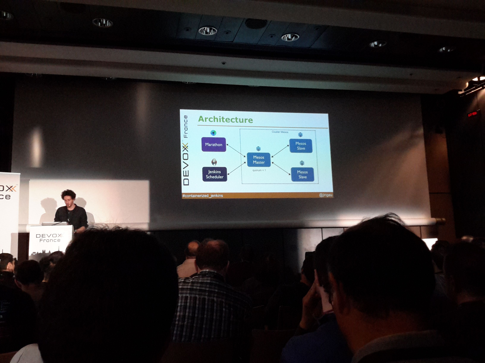
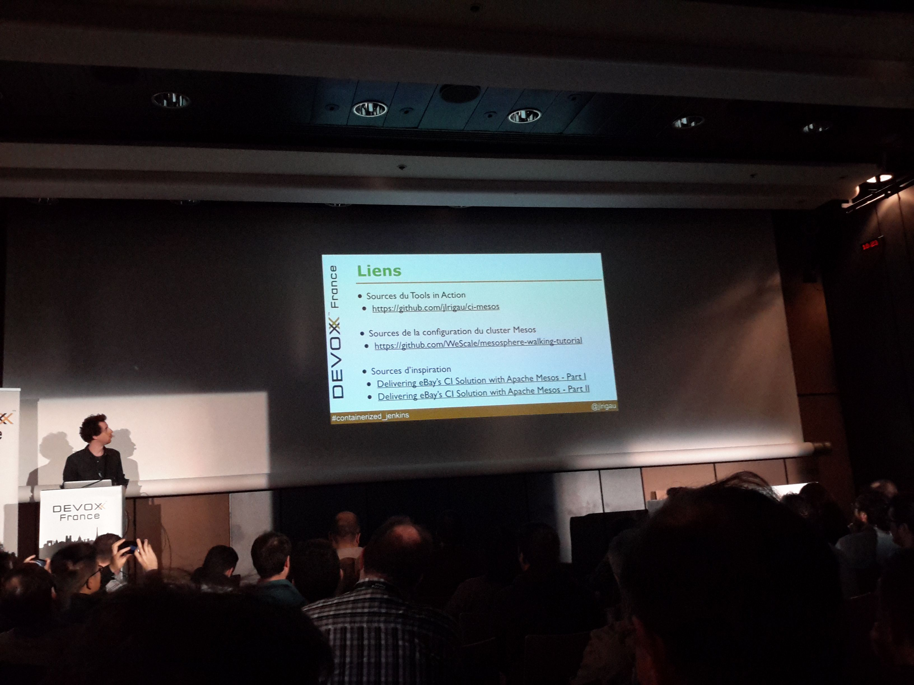

// We start with some Deck.js options
// Here we want to add back/next icons to our slides
:navigation:

// Here we have the title of our slides, and the speaker
= Un Jenkins amélioré avec Docker, Mesos et Marathon
presented by Jean-Louis Rigau (Xebia) at Devoxx France 2015

== Architecture générale

On conteneurise Jenkins dans Docker, puis on le clusterise dans Mesos avec Marathon.

== Marathon

[options="step"]
* Récupération des ressources auprès du Mesos master
* Envoi de l'ordre de déploiement au Jenkins master

== Les différents Jenkins

Seuls les Jenkins slave vont s'occuper des builds, pas le master.
C'est le Jenkins-Scheduler qui déploie les Jenkins slave, et c'est Marathon qui déploie le Jenkins master.

== A savoir 

[options="step"]
* Mis à part le docker file, des GUIs sont disponibles pour chaque outil, y compris pour la gestion quotidienne de la solution
* Marathon et Jenkins-Scheduler sont tous les 2 des plugins Mesos.

== Ressources

